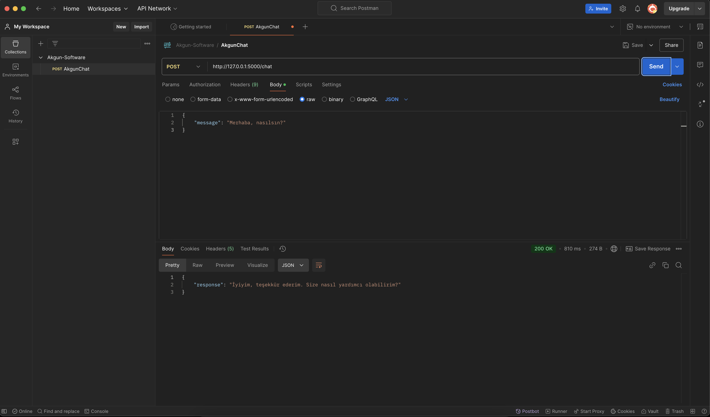

<h1 align="center">
    
  <br>
  LLaMa 3.1 Chatbox Servisi - AKGÜN YAZILIM
</h1>

---

Bu proje, [LLaMa 3.1](https://ollama.com/library/llama3.1:8b) modelinin en düşük kaynak gereksinimine sahip sürümünü kullanarak basit bir sohbet (chat) servisi sunmayı amaçlar. Flask tabanlı bir REST API üzerinden Postman gibi araçlarla mesaj gönderip model yanıtı alabilirsiniz.

## Özellikler

- **LLaMa 3.1 Modeli:** Ollama CLI aracılığıyla lokal makinede çalışır.
- **Flask REST API:** Basit bir `/chat` endpoint’i üzerinden mesaj alıp yanıt döndürür.
- **JSON Formatı:** Hem istek hem de yanıtlar JSON formatındadır.
- **Kolay Entegrasyon:** Postman, cURL veya herhangi bir HTTP istemcisiyle test edilebilir.

---

## Gereksinimler

1. **Python 3.7+** (Python 3.9 veya üstü önerilir)
2. **Flask** kütüphanesi
3. **Ollama CLI** (LLaMa 3.1 modelini çalıştırmak için)
4. **LLaMa 3.1 (8B)** model dosyası (lokalde indirili olmalı)

> LLaMa 3.1 modeli, Ollama platformu üzerinden indirilebilir ve lokal makinede çalıştırılabilir. Aşağıdaki adımları takip ederek Ollama ve LLaMa 3.1 modelini yükleyip test edebilirsiniz.
> Ollama ve LLaMa 3.1 model kurulum adımları için [ollama resmi dokümantasyonuna](https://ollama.com/library/llama3.1) göz atabilirsiniz.

---

# 🚀 Kurulum & Çalıştırma

## 1️⃣ Ollama ve LLaMa 3.1 Modelini Kurun
LLaMa 3.1 modelini kullanabilmek için önce **Ollama CLI** aracını yüklemeniz gerekmektedir.

📌 macOS (Homebrew ile)
```bash
brew install ollama
```
📌 Linux (Debian / Ubuntu)
```bash
curl -fsSL https://ollama.com/install.sh | sh
```
📌 Windows (Manuel Kurulum)
Windows kullanıcıları Ollama’yı aşağıdaki adımlarla yükleyebilir:

1. **Ollama’nın resmi yükleyicisini indirin:**  
   🔗 [Ollama Windows Yükleyicisi](https://ollama.com/download/windows)

2. **İndirilen `.exe` dosyasını çalıştırın ve yükleme adımlarını tamamlayın.**


Kurulum tamamlandıktan sonra terminali kapatıp yeniden açın ve aşağıdaki komut ile Ollama'nın başarıyla yüklendiğini doğrulayın:
```bash
ollama --version
```
Eğer şu şekilde bir çıktı alıyorsanız, Ollama başarıyla kurulmuştur:
```bash
ollama 0.1.20
```

## 2️⃣ LLaMa 3.1 Modelini İndirin
Ollama başarıyla kurulduktan sonra, LLaMa 3.1 (8B) modelini bilgisayarınıza indirmek için şu komutu çalıştırın:
```bash
ollama pull llama3.1:8b
```
Model başarıyla indirildiğinde, aşağıdaki komut ile yüklü modelleri listeleyebilirsiniz:
```bash
ollama list
```
Çıktı şu şekilde olmalıdır:
| NAME      | ID             | SIZE  | MODIFIED    |
|-----------|---------------|-------|------------|
| llama3.1:8b | 46e0c10c039e | 4.9 GB | .. minutes ago |

Bu, modelin başarıyla indirildiğini ve kullanılmaya hazır olduğunu gösterir.


## 3️⃣ Projeyi Klonlayın ve Çalıştırın
1. **Projeyi Klonlayın**
```bash
git clone https://github.com/aliakkayamain/Akgun-Chatbox.git
```
**Şimdi projenin içine girin:**
```bash
cd Akgun-Chatbot
```

2. **Sanal Ortam Oluşturun ve Aktif Edin**
```bash
python -m venv venv
```
📌 Windows için
```bash
venv\Scripts\activate
```
📌 macOS/Linux için
```bash
source venv/bin/activate
```

3. **Gerekli Kütüphaneleri Yükleyin**
```bash
pip install -r requirements.txt
```

4. **API'yi Başlatın**
```bash
python app.py
```
Varsayılan olarak sunucu http://127.0.0.1:5000 adresinde çalışacaktır.

---

# 💬 API Kullanımı

### 📌 Sohbet API’si (POST /chat)

Postman ile Test
Postman kullanarak http://127.0.0.1:5000/chat adresine aşağıdaki JSON formatında istek atabilirsiniz:

🔹 **İstek (JSON Gönderimi)**  
```json
{
    "message": "Merhaba, nasılsın?"
}
```

🔹 **Yanıt (JSON Döndürülen Cevap)**
```json
{
    "response": "Merhaba! Ben iyiyim, size nasıl yardımcı olabilirim?"
}
```

---

# 📷 API Test Görüntüsü


---

# 📂 Proje Yapısı
```
AKGUN-CHATBOX/
│
├── __pycache__/         # Python tarafından derlenen bytecode dosyaları
│
├── docs/                # Dökümanlar ve ekran görüntüleri için ayrılmış klasör
│   └── images/          # Proje ile ilgili ekran görüntüleri
│
├── routes/              # API endpoint'lerini içeren klasör
│   ├── __pycache__/     # Python tarafından derlenen bytecode dosyaları
│   ├── chat.py          # "/chat" endpoint'ini tanımlayan kodlar
│   └── index.py         # "/" (root) endpoint'ini tanımlayan kodlar
│
├── .gitignore           # Git'e dahil edilmemesi gereken dosyaları belirleyen ayarlar
├── app.py               # Flask uygulamasının ana giriş noktası ve blueprint kayıtları
├── config.py            # Konfigürasyon ayarları (örn. DEBUG, PORT vb.)
├── README.md            # Proje dokümantasyonu
├── requirements.txt     # Proje bağımlılıklarının listesi (Flask vb.)
└── venv/                # Python sanal ortam (virtual environment) klasörü
```

---

# 📌 Hakkında

Bu proje **Ali Akkaya** tarafından **Akgün Yazılım** için geliştirilmiştir.  
LLaMa 3.1 modeli kullanılarak oluşturulan bu sohbet botu, Flask tabanlı bir REST API ile entegre edilmiştir ve yerel olarak çalıştırılabilir.

💡 **Proje Amacı:**  
Bu proje, yapay zeka modelleriyle temel düzeyde çalışma ve API entegrasyonu becerilerini geliştirmek amacıyla hazırlanmıştır.

---

## 📬 İletişim  

📩 **Geliştirici:** Ali Akkaya  
📧 **E-posta:** [aliakkayamain@gmail.com](mailto:aliakkayamain@gmail.com)  
